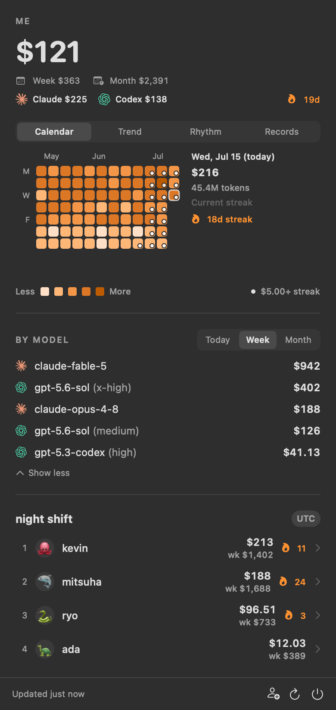
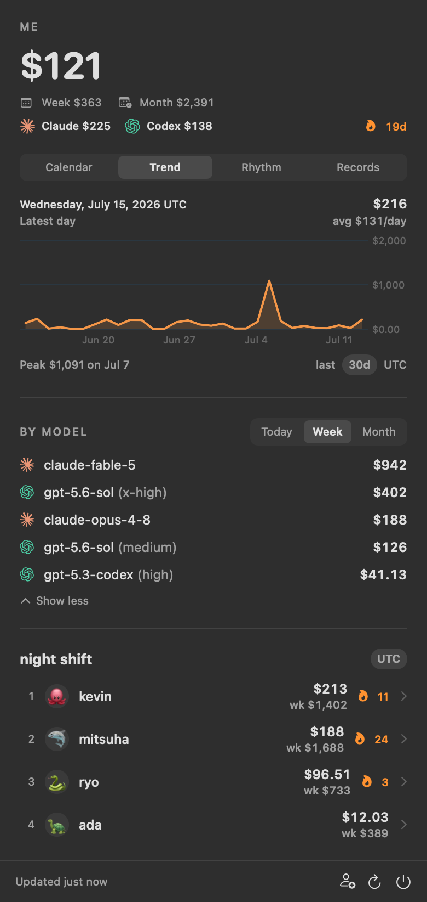
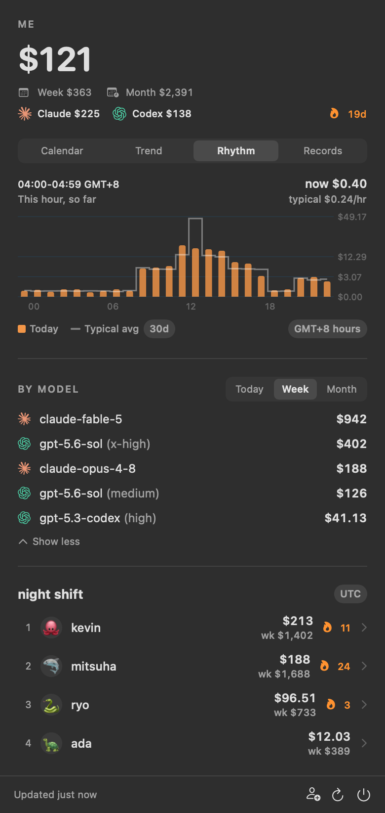
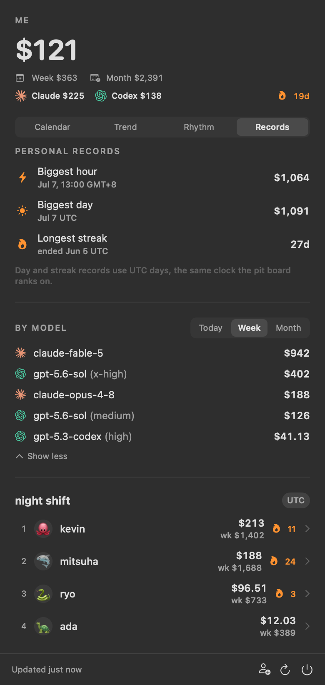
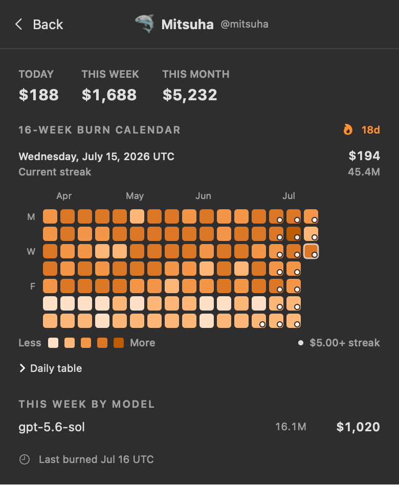
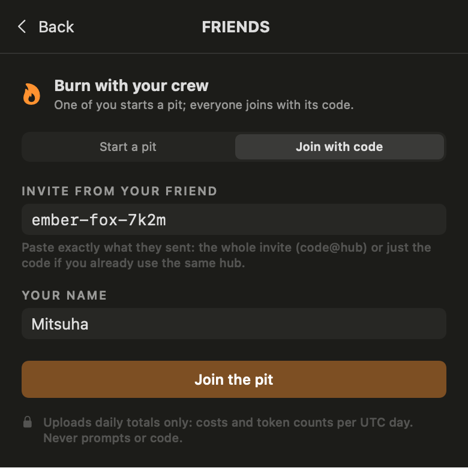

# brrrn 🔥

**WHOOP for token burn.** A tiny native macOS menu bar app (plus CLI) that
shows the API-value cost of every token you burn in Claude Code and Codex,
then lets a private crew of friends compare today, this week, and this month.

No global leaderboard. No accounts. No prompts ever leave your Mac.

[](https://github.com/kevinsslin/brrrn/actions/workflows/ci.yml)
[](LICENSE)


## What it looks like

| Burn calendar + crew board | 30-day trend | Hour-of-day rhythm |
|:--:|:--:|:--:|
|  |  |  |

| Personal records | Friend drill-down | Join a crew in-app |
|:--:|:--:|:--:|
|  |  |  |

Screenshots are rendered from the real views with demo data and stay in sync
with the code: `cd app && swift build && .build/debug/BrrrnBar --screenshots
../docs/screenshots`.

## Why

Existing tools answer "how much quota do I have left" or "how much did I
spend, alone, in a terminal". Nobody does the social loop: seeing your
friends' daily burn the way WHOOP shows a team's recovery scores. Burn is a
flex, not a worry. brrrn is built around that emotion:

- **Me**: today / this week / this month, Claude vs Codex split, cost-first
  model rows (`gpt-5.6-sol (x-high)`) with hover token detail.
- **Analytics**: a GitHub-style burn calendar, a 14/30/90-day trend line, an
  hour-of-day rhythm chart in *your* timezone, and gym-style personal
  records with a live "PR NOW" badge while a record is being set.
- **The pit**: a private board for your crew. Invite code in, no accounts,
  ranked by today's burn, $5/day streaks, emoji avatars.

And it is deliberately tiny: **about 1.2 MB compressed, 3.5 MB installed**,
native SwiftUI over a Rust engine, no Electron. CI enforces a 2 MB
download budget so it stays that way.

## Install

Build from source (Rust + Swift toolchains, macOS 14+):

```sh
git clone https://github.com/kevinsslin/brrrn
cd brrrn/app
./scripts/build-app.sh
open dist/BrrrnBar.app
```

The bundle embeds the CLI, so that is the only build step you need. Signed
GitHub Releases, a Homebrew tap, and `cargo install brrrn` are on the
[roadmap](#roadmap).

## CLI quick start

```sh
cargo build --release

./target/release/brrrn                  # all-time burn by model
./target/release/brrrn --period week    # ISO week, Monday 00:00 UTC
./target/release/brrrn --daily          # per-day table
./target/release/brrrn --json           # machine-readable, feeds the app
```

Days use UTC by default so friends in different timezones compare the same
calendar day; `--tz local` opts personal reports into local days. A full
8.9 GB history scan takes about 8 seconds once. The per-file incremental
cache brings warm scans to roughly 0.1 seconds.

## Add friends

A friend group is called a **pit**. Membership is intentionally simple:
share a server-generated invite code in your group chat. In the app, the
👤+ button in the footer starts or joins a pit with no terminal involved.

### 1. Deploy your hub (once per crew)

The backend is a single Cloudflare Worker with KV storage and one Durable
Object. The free tier comfortably covers a friend group; there are no
accounts and nothing to operate.

```sh
cd hub
npm test
npx wrangler kv namespace create BRRRN_KV
# put the returned namespace ID in hub/wrangler.toml
npx wrangler deploy
```

### 2. Create a pit and invite your crew

```sh
brrrn config set-hub https://brrrn-hub.<account>.workers.dev
brrrn pit new --name "night shift"        # prints the join code
```

Each person joins with their own handle and backfills their history:

```sh
brrrn pit join ember-fox-x7kq --as kevin
brrrn submit
```

### 3. Watch the fire

```sh
brrrn pit              # the board
brrrn pit show kevin   # one member's recent history
brrrn flex             # brag on social media
```

The first submit backfills all available daily history in one POST. Later
submits send today and yesterday. Multiple Macs get distinct machine IDs
and add together instead of overwriting each other. Boards refresh every
five minutes in the app.

## What gets uploaded

Only these daily aggregates leave the machine, and only after you join a pit:

- pit code and handle
- random machine ID
- UTC date
- token count and API-value USD cost
- Claude/Codex cost split
- per-model input tokens, output tokens, and cost

Never uploaded: prompts, responses, file paths, repository names, session
content, or timestamps finer than a UTC day. If you never run `pit join` or
`submit`, nothing leaves your machine at all.

This is an honor-system leaderboard for people you know. It does not attempt
to prevent a friend from submitting fake numbers.

## Data sources

- Claude Code: `~/.claude/projects/**/*.jsonl`. Assistant usage records include
  input/output tokens, 5-minute and 1-hour cache creation, cache reads, model,
  and speed. Resumed-session copies are deduped by message/request identity.
- Codex: `~/.codex/sessions/**/*.jsonl`. Cumulative `token_count` events are
  converted into deltas and attributed to the latest model/reasoning effort.
  Forked rollout replays are deduped by timestamp and cumulative totals.

## Pricing and interpretation

Prices are API list-price equivalents from
[LiteLLM's pricing table](https://github.com/BerriAI/litellm), cached at
`~/Library/Caches/brrrn/litellm_prices.json`.

If you use Claude Max or ChatGPT Pro, the number is not money charged to your
card. Read it as **API value extracted from the subscription**.

Known pricing gaps:

- Codex multi-agent child sessions sometimes omit their model and appear as
  `unknown` (tokens count, cost does not).
- Models with no public LiteLLM price show `n/a` cost.
- Claude fast rows remain separate, but use standard pricing until a distinct
  public fast-mode price is available.
- Fast mode (Claude fast, Codex priority tier) folds into its model row;
  the hover detail shows the fast/standard split. Priced at standard rates
  until distinct tier pricing is published.

## Timezone model

Anything social is UTC, so "who won today" means the same day for everyone.
Anything personal follows your clock. Concretely: the calendar, trend,
streaks, and boards use UTC days; the rhythm chart re-buckets the engine's
UTC hour instants into your local timezone (exact at hour granularity, with
a UTC toggle); the biggest-hour record is shown in local time.

## Architecture

| Piece | Stack | Job |
|---|---|---|
| `src/` | Rust | Log scanning, dedupe, pricing, UTC day/hour aggregation, incremental cache, social CLI |
| `app/` | Swift, SwiftUI, Charts | Menu bar app: analytics, boards, in-app pit setup, five-minute auto-sync |
| `hub/` | Cloudflare Worker + KV + Durable Object | Pit storage, atomic joins, rate limits, board reads |

Product decisions, API schema, and the trust model live in [PRD.md](PRD.md).

## Development

```sh
cargo fmt --check
cargo clippy --all-targets -- -D warnings
cargo test                              # engine

cd hub && npm test                      # worker
cd app && swift test                    # app
cd app && ./scripts/build-app.sh        # release bundle + size budget
```

For app development against a local engine build:

```sh
cd app
BRRRN_BIN=../target/release/brrrn swift run BrrrnBar
```

The project uses conventional commits and test-first coverage for parsing,
deduplication, pricing, calendar windows, streaks, timezone re-bucketing,
cache invalidation, Worker routes, frozen JSON schemas, and rendering-free
view logic. See [CONTRIBUTING.md](CONTRIBUTING.md).

## Roadmap

- Signed, notarized GitHub Releases; Homebrew tap; `cargo install brrrn`
- v2 social API in the clients: direct friends, named groups, and single-use
  invitation links (the hub side is implemented and tested)
- Synced custom avatars
- Per-pit Durable Object sharding for large shared hubs
- Spotify-Wrapped-style weekly share cards

## License

MIT. See [LICENSE](LICENSE). Burn responsibly.
